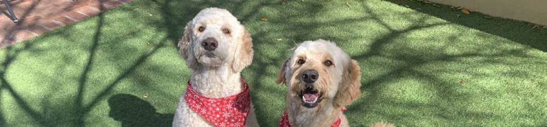
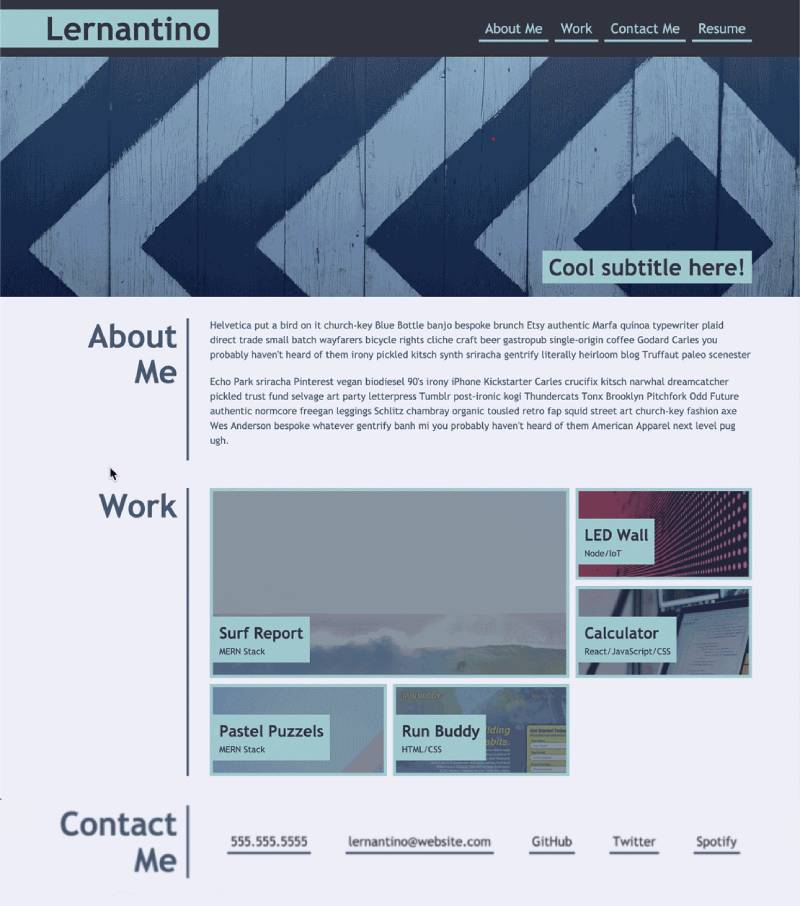

  
# Web Development Portfolio
## University of Arizona Bootcamp  
## December 2020
### Vicky Loebel

[vloebel.github.io/Portfolio](https://vloebel.github.io/Portfolio/) 

**Original Development by**
Vicky Loebel  

## Overview
A portfolio website showcasing the web-development projects written or modified by Vicky Loebel.   

## Requirements  
A one-page responsive website including:
* HEADER Section:  
   * Developer's name  
   * Menu linking to each of the other sections  
* ABOUT ME Section: 
   * Developer's photo
   * Short biography  
* WORK Section:  
   * Images of applications (or application placeholders) that showcase developer's work 
       * The first application/image should be larger than the others 
   * Titles on each image stating  
       * Application Name  
       * Web-development function it showcases (e.g."HTML/CSS")
   * Links on each image to corresponding live application  
       * Placeholders do not require links  
* CONTACT ME Section  
   * phone, email, and social media links. 

## Website  Mockup

## Additional Notes
   * Photographic placeholders will be used when no external application is available for showcasing. 
   * A combination of five live and dummy sites will be presented.
   * Application should be "mobile-first" - designed to appear best on a small screen with additional CSS to optimize layouts on larger screens.  

*REVISION HISTORY*
 - 12/20/2020 submitted - responsive design pending